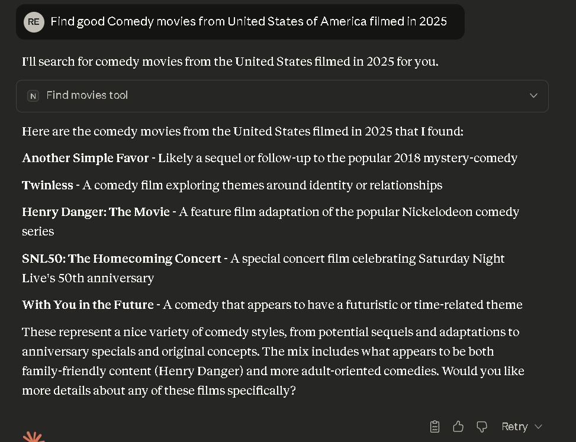
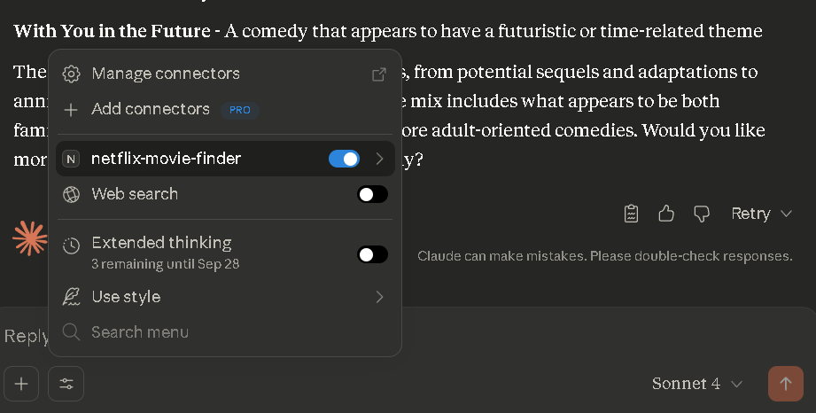
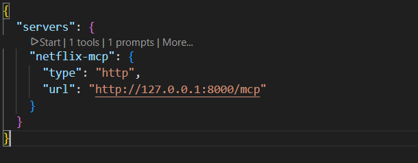
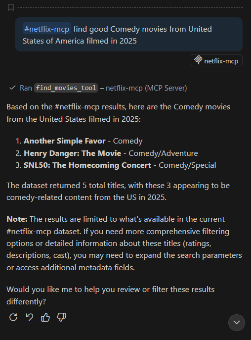

## NETFLIX Search MCP

Simple MCP server to find the best ranked movie according to the genre.



### DataSet

https://www.kaggle.com/datasets/bhargavchirumamilla/netflix-movies-and-tv-shows-till-2025?

### Setting up the environment

Requirments: python 3 and pip

1. Create a new virtual environment: python -m venv /.venv/
2. Activate venv (source .venv/bin/activate for linux/mac or .venv/Scripts/activate for Windows)
3. Install requirements pip install -r requirements.txt

### Running the server

python .\server.py
server will be running at http://127.0.0.1:8000/mcp

### Setting up the client (Claude)

1. Open claude_desktop_configuration.json (%%USER_FOLDER%%\AppData\Roaming\Claude\claude_desktop_config.json)

2. Register the tool

```
{
  "mcpServers": {
    "netflix-movie-finder": {
      "command": "uv",
      "args": [
        "--directory",
        "PROJECT_FOLDER",
        "run",
        "server.py"
      ]
    }
  }
}
```

3. Restart Claude

4. Check if the tool is registered 



### Setting up the client (VSCode - Copilot)

1. Configure VSCode - Copilot
https://code.visualstudio.com/docs/copilot/customization/mcp-servers#_add-an-mcp-server-from-the-github-mcp-server-registry

2. Copy mcp.json to .vscode folder 

3. Open the mcp.json file in the VSCode and start the server



4. Ask a question in the chat refering to the netflix-mcp tool prefering the Claude models.



