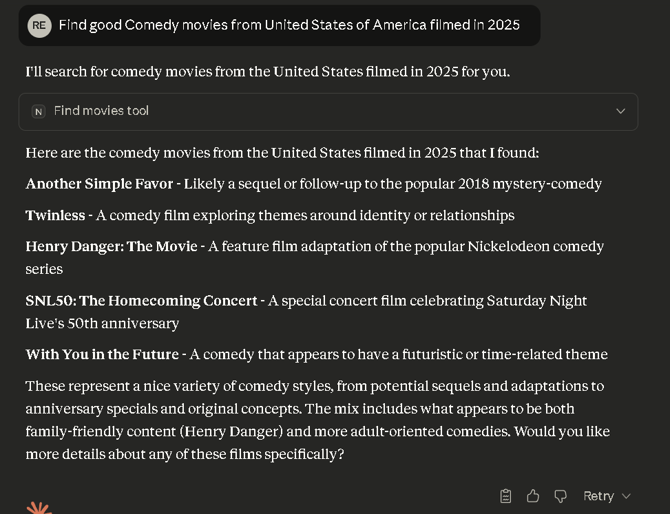

## NETFLIX Search MCP

Simple MCP server to find the best ranked movie according to the genre.

### DataSet

https://www.kaggle.com/datasets/bhargavchirumamilla/netflix-movies-and-tv-shows-till-2025?

### Configuring the environment

Requirments: python 3, pip and uv (pip install uv)

1. Create a new virtual environment: uv venv
2. Activate venv (source .venv/bin/activate for linux/mac or .venv/Scripts/activate for Windows)
3. Install requirements pip install -r requirements.txt

### Running the server

uv run .\server.py

### Setting up a client (Claude)

1. Open claude_desktop_configuration.json (%%USER_FOLDER%%\AppData\Roaming\Claude\claude_desktop_config.json)

2. Register the tool

{
  "mcpServers": {
    "netflix-movie-finder": {
      "command": "uv",
      "args": [
        "--directory",
        "PROJECT_FOLDER",
        "run",
        "server.py"
      ]
    }
  }
}

3. Restart Claude

4. 